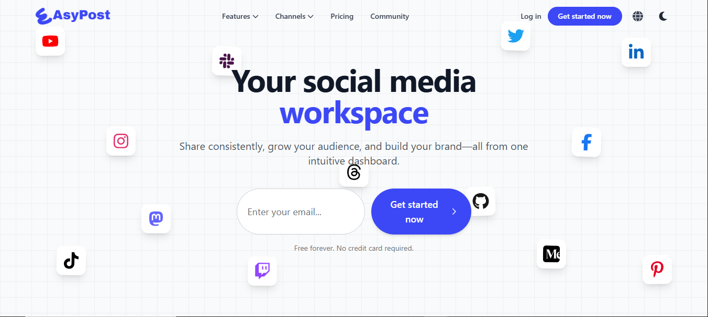

# EAsyPost - Modern Social Media Dashboard Frontend


A beautifully designed, feature-rich frontend for a modern social media management platform, inspired by industry leaders like Buffer and Vercel. This project was built from the ground up using a professional tech stack including Vite, React, TypeScript, and Tailwind CSS.

### [View Live Demo](https://gekkin-programmer.github.io/EasyPostV2/)
*(Note: Link will be active after deployment)*

---

##  Screenshots

| Homepage (Hero Section) | Pricing Page |
| :---: | :---: |
|  |  |
| **Login Page** | **Navbar Mega Menu** |
|  ||


##  Key Features

-   **Fully Responsive Design:** A seamless experience on desktop, tablet, and mobile.
-   **Dark / Light Mode:** Beautiful, persistent light and dark themes.
-   **Multi-Language Support:** Easily switch between English and French with a custom React Context.
-   **Custom Branded Preloader:** A stunning SVG animation of the EAsyPost logo on initial app load.
-   **Dynamic Navbar:**
    -   Shrinks and adds a shadow on scroll.
    -   Features a rich, multi-column "Mega Menu".
    -   Includes a custom icon-based "Channels" dropdown.
    -   "Most Popular" badge on the pricing link.
-   **Complete Authentication UI Flow:**
    -   Modern Login, Sign Up, and Forgot Password pages.
    -   Social login (Google) prominent.
    -   Show/hide password functionality.
-   **Interactive Pricing Page:** Includes a sleek monthly/annual toggle and an expandable feature list.
-   **Advanced Animations:** Smooth, performant animations throughout the app using Framer Motion.
-   **Auto-scrolling "Infinite" Carousels:** Used for showcasing partner logos and resources.
-   **Helpful 404 Page:** A clean, user-friendly "Not Found" page to guide lost users.

##  Tech Stack

-   **Framework:** [React](https://reactjs.org/)
-   **Build Tool:** [Vite](https://vitejs.dev/)
-   **Language:** [TypeScript](https://www.typescriptlang.org/)
-   **Styling:** [Tailwind CSS](https://tailwindcss.com/)
-   **Animation:** [Framer Motion](https://www.framer.com/motion/)
-   **Routing:** [React Router DOM](https://reactrouter.com/)
-   **Icons:** [React Icons](https://react-icons.github.io/react-icons/)

---

##  Getting Started

To run this project locally, follow these steps:

1.  **Clone the repository:**
    ```bash
    git clone https://github.com/gekkin-programmer/EasyPostV2.git
    ```

2.  **Navigate to the project directory:**
    ```bash
    cd EasyPostV2/frontend
    ```

3.  **Install dependencies:**
    ```bash
    npm install
    ```

4.  **Run the development server:**
    ```bash
    npm run dev
    ```
    The application will be available at `http://localhost:5173` (or another port if 5173 is in use).

##  Deployment

This project is configured for easy deployment to GitHub Pages.

After setting up your repository, simply run:
```bash
npm run deploy
```
This command will build the project and push the contents of the `dist` folder to the `gh-pages` branch.
